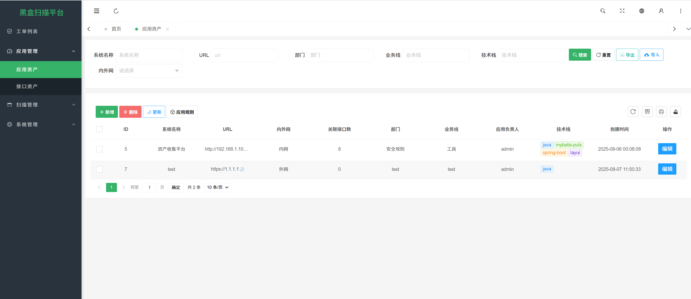

# 										黑盒测试平台

> 本平台是黑盒测试平台的一种实现方案

**方法技术：**python+mitmproxy，利用中间人代理技术实现流量的抓取

**场景：**在开发测试阶段，测试同学设置代理到平台监听端口，设置扫描配置规则，可以自动发起黑盒扫描

**缺点：**需要每一位开发测试同学进行配置，https流量还需安全证书，还会影响正常的使用

<font style="color:red; font-weight: bold">更优方案：</font>利用探针的方式采集流量，这样对于测试同学是无感的，也不需要任何配置

黑盒扫描平台可融入CICD流程、SDL流程，在测试阶段就发现安全问题，及时修复防止漏洞逃逸到线上：


## 使用

测试同学在使用时：浏览器设置代理，默认8888端口，推荐使用[SwitchyOmega](chrome-extension://hihblcmlaaademjlakdpicchbjnnnkbo/options.html#!/about)插件，填写IP、端口


https流量需要安装证书，如下：


浏览器设置代理后，访问http://mitm.it:


下载证书后，安装证书即可，windows安装到受信任的根域：


## 主要功能

### 两大模块

- 资产收集模块
- 黑盒扫描模块

#### 资产收集

手动添加资产（可导入），点击应用规则可重置配置规则（初始化时不需要）：



在开发测试时，会自动搜集API接口数据（默认24小时之后重复收集到才会更新数据）：


#### 黑盒扫描

规则配置模块，手动添加扫描规则，对应host为扫描配置项：

规则配置json数据：

```json
[
    {
        "ruleName": "水平越权", 
        "ruleDescribe": "替换/添加Cookie，仍然可以获取数据，存在水平越权", 
        "ruleMethod": "*", 
        "rules": {
            "addHeader": [
                "Cookie: username=test"
            ]
        }
    }
]
```


> 目前只支持修改header参数

所有的接口扫描过的接口都会记录：


默认大于24小时才会重新扫描，默认相似度大于0.7才会判断有漏洞，会自定生成工单：


生成的工单默认都是`待确认`状态，需要手动编辑：


运营同学判断成功后，选择`待修复`状态，进入正常的修复流程：


## 参考

前端参考：[Pear Admin Layui: 🌈 Pear Admin 是 一 款 开 箱 即 用 的 前 端 开 发 模 板](https://gitee.com/pear-admin/pear-admin-layui) 、豆包AI编程

## 后续计划

- 补齐用户管理和配置管理
- 黑盒扫描模块添加传统漏洞扫描：ssrf、sql注入等
- 添加修改GET请求参数
- 接口描述和修复漏洞对接 AI
- 流量对比模块实现不同项高亮显示